<!-- Generated by GitHub Profile Agent Console. Edit profile.config.json, then run npm run generate. -->

  <picture>
    <source media="(max-width: 760px) and (prefers-color-scheme: dark)" srcset="./assets/hero/agent-console-1680cf5d-mobile-dark.svg">
    <source media="(max-width: 760px)" srcset="./assets/hero/agent-console-1680cf5d-mobile-light.svg">
    <source media="(prefers-color-scheme: dark)" srcset="./assets/hero/agent-console-1680cf5d-dark.svg">
    <source media="(prefers-color-scheme: light)" srcset="./assets/hero/agent-console-1680cf5d-light.svg">
    
  </picture>

  

## About Me

I build software at the intersection of AI, web products, and interactive experiences.

My work focuses on reliable systems, thoughtful UX, and tools that turn ideas into real products.

## Current Focus

| Area | What I am exploring |
| --- | --- |
| **Fullstack products** | Reliable web experiences, backend systems, and product-minded engineering. |
| **AI systems** | Applied agents, automation workflows, and practical AI integrations. |
| **Game tooling** | Interactive experiences, tooling, and polished user-facing features. |

## Featured Work

| Project | Focus | Why it matters |
| --- | --- | --- |
| [**Abyss Walker**](https://drive.google.com/drive/folders/1FKSyG56EY9pZadOPE-2npYCThdWzyX-q?usp=sharing) | 2D pixel game | A full-stack 2D pixel game project built with Unity and Aseprite, focused on gameplay, art, and polished experience. |
| [**Anomaly Chase**](https://drive.google.com/drive/folders/1UB4JwxtIXJ0uAskvVuYqfE6oUMoKOJWq?usp=sharing) | Gameplay & systems | Character design, core gameplay mechanics, and debugging work for an action-oriented game prototype. |
| [**RATURU Home Fever**](https://drive.google.com/drive/folders/1tVfJwvPPmfe2QeAdjtUlrre100QB2GNN?usp=sharing) | Environment art | A low-poly 3D environment and visual identity project covering art direction, icon design, and game visuals. |
| [**Cyber Education**](https://drive.google.com/drive/folders/1tl5Ma4flqQRTwkkx8YfGy7_xrSJwlvN7?usp=sharing) | WebGL game level | Developed gameplay logic and debugging for the final level of a browser-based educational game experience. |
| [**KAHF Analyzer**](https://hair-analyzer.kahfeveryday.com/) | Fullstack web app | Built the frontend, database integration, and backend logic for a production web application with API connectivity. [Live](https://hair-analyzer.kahfeveryday.com/) |
| [**GarionX AI**](https://garionx.vercel.app/) | AI product platform | Developed a multi-agent AI platform with custom agents, dynamic routing, and multimedia AI tooling. [Live](https://garionx.vercel.app/) |

## Research Direction

I am especially interested in systems where AI helps people reason, automate tasks, and ship products with clear control and measurable outcomes.

## Tech Stack

`TypeScript` · `Next.js` · `Python` · `Solidity` · `Stellar` · `PostgreSQL` · `Playwright`

## Recent Activity

<!-- AUTO:ACTIVITY:START -->
- Jul 26, 2026: pushed 1 commit to [GaroxXiz/GaroxXiz](https://github.com/GaroxXiz/GaroxXiz).
- Jul 25, 2026: pushed 1 commit to [GaroxXiz/GaroxXiz](https://github.com/GaroxXiz/GaroxXiz).
- Jul 25, 2026: created a branch in [GaroxXiz/GaroxXiz](https://github.com/GaroxXiz/GaroxXiz).
<!-- AUTO:ACTIVITY:END -->

---

  Building practical products with AI, code, and thoughtful systems design.

