<!-- Generated by GitHub Profile Agent Console. Edit profile.config.json, then run npm run generate. -->

  <picture>
    <source media="(max-width: 760px) and (prefers-color-scheme: dark)" srcset="./assets/hero/agent-console-9f1eebf5-mobile-dark.svg">
    <source media="(max-width: 760px)" srcset="./assets/hero/agent-console-9f1eebf5-mobile-light.svg">
    <source media="(prefers-color-scheme: dark)" srcset="./assets/hero/agent-console-9f1eebf5-dark.svg">
    <source media="(prefers-color-scheme: light)" srcset="./assets/hero/agent-console-9f1eebf5-light.svg">
    
  </picture>

  

## About Me

I build software at the intersection of AI, web products, and interactive experiences.

My work focuses on reliable systems, thoughtful UX, and tools that turn ideas into real products.

## Current Focus

| Area | What I am exploring |
| --- | --- |
| **Fullstack products** | Reliable web experiences, backend systems, and product-minded engineering. |
| **AI systems** | Applied agents, automation workflows, and practical AI integrations. |
| **Game tooling** | Interactive experiences, tooling, and polished user-facing features. |

## Featured Work

| Project | Focus | Why it matters |
| --- | --- | --- |
| [**GarionX AI**](https://github.com/GaroxXiz/garionx-ai) | Agentic payment infrastructure | A practical layer for monetizing API access through transparent, blockchain-backed settlement flows. |
| [**Fradium**](https://github.com/fradiumofficial/fradium) | AI-powered trust layer | Address analysis and threat detection for safer Web3 activity with clear signals. [Live](https://fradium.io) |
| [**NovaAI**](https://github.com/OfficialNovaAI/nova-wallet) | AI wallet orchestration | A chat-first wallet layer for transaction preparation, analysis, and payments. |
| [**Quorum**](https://github.com/GaroxXiz) | Autonomous coordination | An exploration of coordination and accountability across autonomous agent systems. |

## Research Direction

I am especially interested in systems where AI helps people reason, automate tasks, and ship products with clear control and measurable outcomes.

## Tech Stack

`TypeScript` · `Next.js` · `Python` · `Solidity` · `Stellar` · `PostgreSQL` · `Playwright`

## Recent Activity

<!-- AUTO:ACTIVITY:START -->
_Recent public activity will appear here after the workflow runs._
<!-- AUTO:ACTIVITY:END -->

---

  Building practical products with AI, code, and thoughtful systems design.

